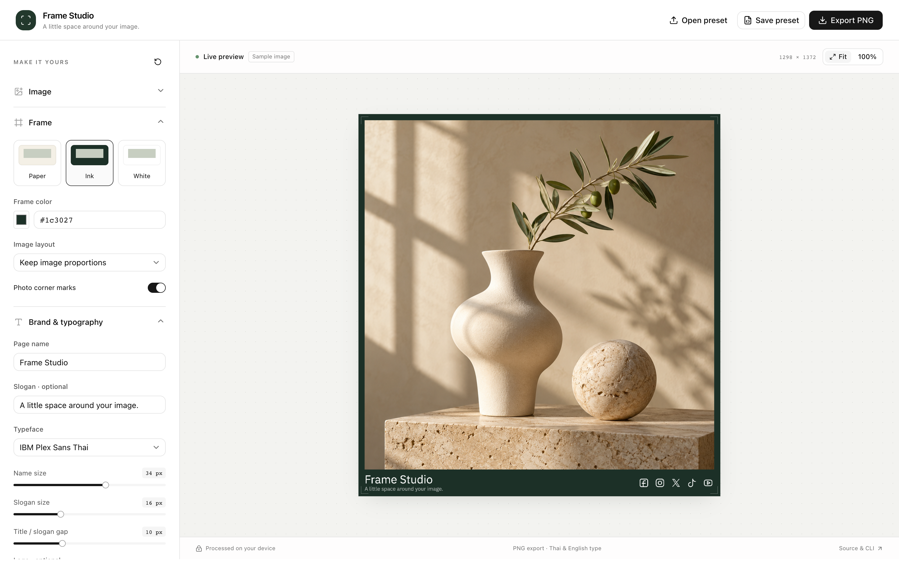

# Frame Studio

A minimal image framing studio for web and CLI. Customize frames, typography,
logos, and social icons with Thai and English font support.



## Start locally

Requires Node.js 22+ and pnpm 11.

```bash
pnpm install
pnpm dev
```

Open http://localhost:3000. Choose an image, customize the frame, and export a
PNG. Images are processed on your device. There are no accounts or uploads.
The initial sample is generated artwork; page name, slogan and logo are empty.

## Customize

- **Frame:** Paper, Ink or White, custom color, original proportions or square,
  margins, fine edge or soft shadow, and photo corner marks.
- **Brand:** Thai/English page name, smaller slogan beneath it, font sizes,
  vertical gap, alignment and an optional logo file.
- **Social:** Facebook, Instagram, X, TikTok and YouTube, with adjustable size.
- **Export:** Native image pixels by default, or 1080, 2160 or 4096 px width.
  PNG is lossless. A smaller output width reduces image detail.

Use **100%** to inspect detail. **Save preset** exports settings as JSON; **Open
preset** restores them. Images and logos remain separate files. Controls use
reference pixels at a width of 1080 and scale with the output. If a caption does
not fit, increase footer height or reduce text size.

## CLI

Requires Chrome or Chromium; local Chrome is detected automatically.

```bash
pnpm frame render --input image.png --output framed.png --name "Page name"
pnpm frame render --input image.png --output framed.png --config preset.json --logo ./logo.svg
pnpm frame batch --input-dir ./images --output-dir ./framed --name "Page name"
pnpm frame --help
```

Flags override the preset. Use `--font-size`, `--slogan-size`, `--slogan-gap`,
`--social-size`, `--preset`, `--color`, `--width` or `--footer` to customize.
Use `--logo-color auto` for a monochrome logo that matches the frame. No logo or
page name is supplied automatically. `project-logo/` contains optional SVGs;
pass a file explicitly. Source images cannot be overwritten.

Use `--browser /path/to/chrome` if needed. Without a local browser:

```bash
pnpm exec playwright install chromium
```

### Use the CLI in another repository

```bash
pnpm pack:cli
# In your other repository:
pnpm add /path/to/frame-studio/dist/frame-studio-kit-0.1.0.tgz
pnpm exec frame-studio render --input image.png --output framed.png --name "Page name"
```

The package includes the renderer, fonts and social assets. It does not require
Next.js. Alternatively, copy the complete `packages/frame-kit/` directory and
install its dependencies; do not copy only `cli.mjs`. Keep the source version
recorded in the consuming repository.

## Deploy

### Vercel

Import the repository, select Next.js, and set **Root Directory** to `apps/web`.
Enable inclusion of files outside the root directory for the shared workspace
package. Leave `NEXT_PUBLIC_BASE_PATH` unset. Use `pnpm install --frozen-lockfile`
and the default `pnpm build` build command. The app serves at the domain root.
See [Vercel's monorepo guide](https://vercel.com/docs/monorepos).

## Development

```bash
pnpm typecheck
pnpm lint
pnpm test
pnpm build
pnpm preview
```

Web and CLI share `packages/frame-kit`. Static assets are synced automatically
before development and builds. Tests validate presets and SVG input without
installing or launching a browser. CI runs on pull requests into `dev` or `main`
and releases pushed to `main`.

`main` is the release branch; `dev` is the integration branch. Create feature
branches from `dev`. Do not develop directly on either protected branch.
Merge into `dev` or `main` with `git merge --no-ff` to preserve branch history.
Use separate, single-line Conventional Commits, such as
`feat(editor): add frame customization controls`.

## Assets

IBM Plex Thai fonts use the included SIL Open Font License. X retains the
geometry from the [official toolkit](https://about.x.com/en/who-we-are/brand-toolkit)
([source archive](https://about.x.com/content/dam/about-twitter/x/brand-toolkit/x-logo.zip),
retrieved 2026-09-30). The other social icons are custom line-style link symbols.
The standalone project logo is optional and is not an official company mark.

The neutral still-life sample was generated with the built-in imagegen tool.
Prompt: "Square fine-art still-life photograph of an ivory ceramic vase with a
single olive branch beside a limestone sphere on a travertine plinth. Soft
afternoon light, warm beige and muted sage, crisp tactile detail, generous
negative space. No text, logos, watermark, border, frame or UI."
